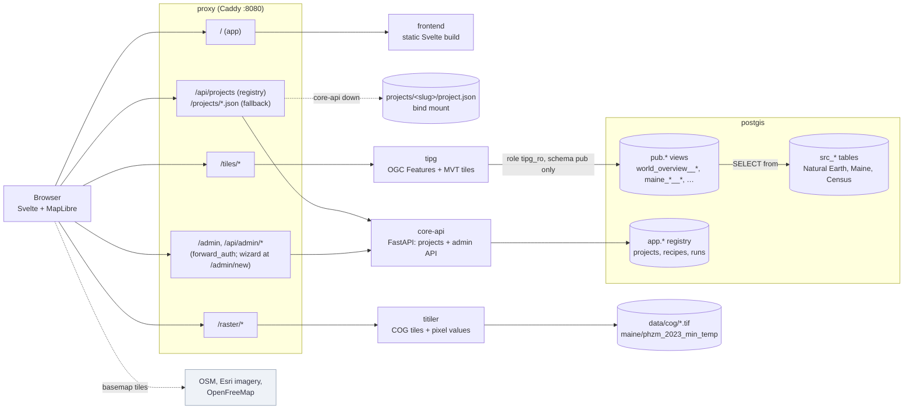
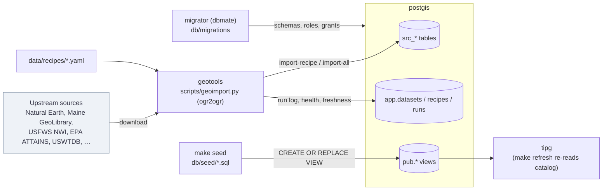
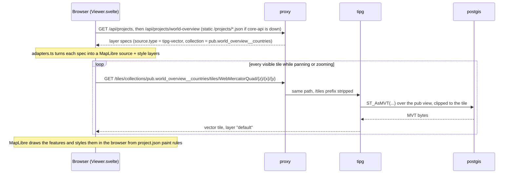
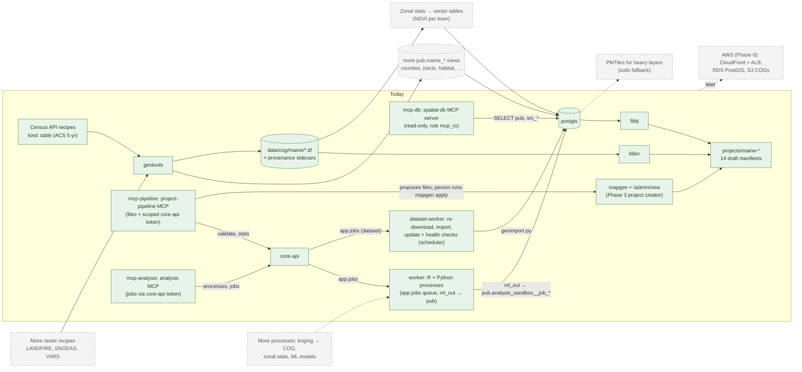

# Architecture

Living diagrams of the stack: what runs **today**, and what the plans in `.claude/plans/` **propose**.
Update this file in the same change that adds or removes a service, route, layer adapter or project.
`make arch-check` (also run by `make verify`) fails if a compose service, adapter type or project is missing here.

Diagrams are [Mermaid](https://mermaid.js.org/). GitHub renders them. In VS Code, install
*Markdown Preview Mermaid Support* (`bierner.markdown-mermaid`) and open the preview (Ctrl+Shift+V).

Key: solid = running today · amber = wired but has no data yet · dashed grey = proposed.

## 1. Runtime today

Everything the browser loads comes through the proxy on `:8080`, except the basemaps, which it fetches straight from
their public hosts.

## 2. Data pipeline today (offline, run by `make`)

Nothing on the web side writes data. Data comes in through the tool containers, and the website only reads it.

**Maine data:** the Maine vector recipes (`me_*`, `nwi_me`, `attains_*`, `uswtdb_me`, `phzm_2023_zones_me`) load into
`src_*` and are published as `pub.maine_*` views (`db/seed/030`–`060`) on four draft projects: maine-coast,
maine-water, maine-lands and maine-infrastructure. The raster recipe `phzm_2023_grid_me` (`kind: raster`) writes a
validated COG to `data/cog/maine/phzm_2023_min_temp.tif`, which titiler serves to maine-lands.

A raster layer loads the same way, but through `/raster/<name>/{z}/{x}/{y}.png` → titiler, which reads the COG
from `data/cog/` (the proxy pins `url=`). Clicking a raster layer asks `/raster/<name>/point/<lon>,<lat>` for the
pixel value shown in the Inspector.

## 3. How one map layer loads

Layer adapters (`frontend/src/lib/adapters.ts`), one per `source.type`:

| Adapter | Fetches from | Used today by |
|---|---|---|
| `tipg-vector` | `/tiles/collections/<pub view>/tiles/…` (MVT) | world-overview, analysis-sandbox, maine-coast, maine-water, maine-lands, maine-infrastructure, maine-overview, maine-terrain, maine-places, maine-soils, maine-facilities, maine-energy, maine-transportation, maine-habitat, maine-broadband |
| `geojson-url` | any GeoJSON URL | nothing yet |
| `raster-xyz` | any XYZ raster tile URL | analysis-sandbox (stub) |
| `raster-cog` | `/raster/<name>/{z}/{x}/{y}.png` (titiler) | maine-lands (hardiness temperature grid), maine-terrain (elevation, hillshade, slope), maine-soils (hydrologic soil group grid), maine-landcover (NLCD 2025, Cropland Data Layer 2025, LANDFIRE vegetation and fuels; categorical) |

## 4. Proposed

Drawn from the `maine-projects`, `maine-etl-catalog`, `admin-dashboard` and `spatial-app-architecture` plans.

## Project creation (Phase 3)

One contract, two front doors, one registry:

- `contracts/project-manifest.v1.schema.json` is the manifest contract. The frontend's types are generated from it
  (`make contracts`, checked by `make verify`), and `contracts/validate.py` checks a manifest against it, against status
  rules, and against the live database (the view exists, tiPG can read it, one geometry column with an SRID, an `id`
  column, a GiST index, field names in popups and styles). The MapLibre style spec is checked by
  `frontend/scripts/validate-styles.mjs`.
- `./mapgen` (CLI, in geotools): `new` scaffolds `projects/<slug>/` from a template, `apply` runs its SQL through the
  migrator (so tiPG's grants apply), refreshes tiPG and registers it; `sync` registers every file.
- `/admin/new` (browser): pick a `pub` view, a style preset (single, categorical, quantile choropleth, graduated
  circles, heatmap; breaks computed in PostGIS), preview, save through core-api. `./mapgen export` writes it to git.
- `app.projects` + `app.manifest_versions` hold what is served; files in `projects/` stay the source of truth in git.

## Services

| Service | Role | Profile |
|---|---|---|
| postgis | Database: `src_*` raw imports, `pub.*` published views, `app.*` registry | default |
| migrator | dbmate: applies `db/migrations`, sets role passwords, then exits | default |
| tipg | Serves `pub.*` views as OGC API Features and vector tiles | default |
| titiler | Serves COGs under `data/cog/` as raster tiles | default |
| core-api | Project registry (`/api/projects`, public reads; `/api/admin/projects`, writes), admin API (`/api/admin/*`) and the auth check for `/admin` | default |
| frontend | Static Svelte build served by Caddy | default |
| proxy | Caddy: the only published port (`:8080`), routes everything | default |
| geotools | GDAL + Python + R: imports, raster work, registry updates | tools |
| node | Frontend install, dev server, type check | tools |
| e2e | Playwright browser tests (`make e2e`) | test |
| mcp-db | spatial-db MCP server for Claude Code: read-only `pub` + `src_*` as role `mcp_ro`, stdio via `.mcp.json` | mcp |
| mcp-pipeline | project-pipeline MCP server: validates via core-api (scoped token), writes only `projects/`, returns `./mapgen apply` | mcp |
| mcp-analysis | analysis MCP server: lists processes, submits and follows jobs via core-api (scoped token) | mcp |
| worker | Analysis worker (FROM geotools): claims `app.jobs`, runs R and Python processes, publishes `pub.analysis_sandbox__job_<id>` | workers |
| dataset-worker | Dataset jobs from the dashboard and its scheduler (update checks, re-download, import, health, enable/disable) via `scripts/geoimport.py`, as `loader` | workers |
